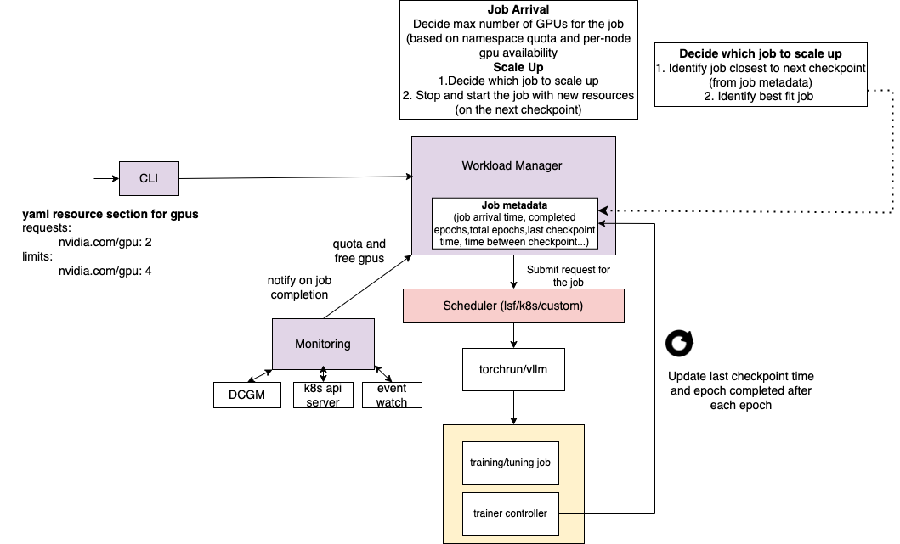

A  lightweight GenAI workload management tool optimizes GPU utilization and job makespan, supports job scaling, GPU sharing and ensures SLA (deadline awareness/completion time) adherence, while managing diverse GenAI workloads (SDG, training, evaluation and serving) under constraints such as dynamic job arrivals, team quotas, priorities, and potential job/system failures, without being tied to orchestrators like Kubernetes and Kueue.

The Version 1 is implemented on top of kubernetes and has the following features: 
- Lightweight
- GenAI aware diverse workloads
- Optimizes GPU Utilization
- Optimizes Job Makespan
- Supports Job Scaling 

[MPV2 branch](https://github.com/IBM/genai-workload-manager/tree/mvp2) does scaling after checkpoints are finished instead of killing jobs immediately (which results in wasted work).

